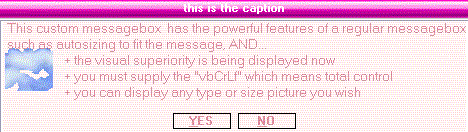



## Evans Custom Message Box \(Updated\)  screenshot says it all  : Þ

### Description

A superior, in many ways, messagebox. Based on my yesterday submission with improvements. It is in the form of an activeX (usercontrol) now and has 6 differents "skins" (red/candy/blue/orange/yellow/silver) has an option of showing the message with no buttons and self closing as fast as you specify...and you can have a picture, any type, any size. This really makes microsoft messagebox look flat and boring.
 
### More Info
 

             |
---                |---
**Submitted On**   |2005-02-15 01:47:26
**By**             |[Evan Toder](https://github.com/Planet-Source-Code/PSCIndex/blob/master/ByAuthor/evan-toder.md)
**Level**          |Intermediate
**User Rating**    |5.0 (50 globes from 10 users)
**Compatibility**  |VB 3\.0, VB 4\.0 \(16\-bit\), VB 4\.0 \(32\-bit\), VB 5\.0, VB 6\.0
**Category**       |[Custom Controls/ Forms/  Menus](https://github.com/Planet-Source-Code/PSCIndex/blob/master/ByCategory/custom-controls-forms-menus__1-4.md)
**World**          |[Visual Basic](https://github.com/Planet-Source-Code/PSCIndex/blob/master/ByWorld/visual-basic.md)
**Archive File**   |[Evans\_Cust1853012152005\.zip](https://github.com/Planet-Source-Code/evan-toder-evans-custom-message-box-updated-screenshot-says-it-all__1-58913/archive/master.zip)

